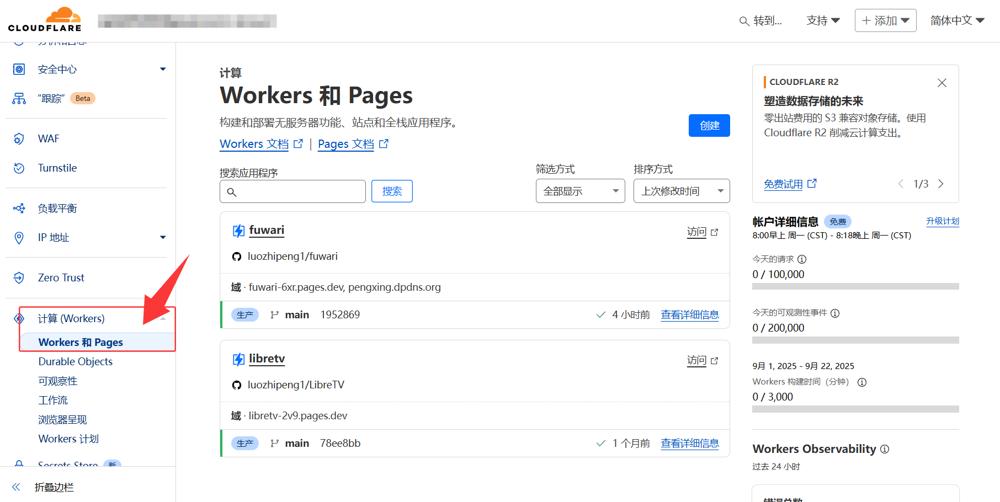
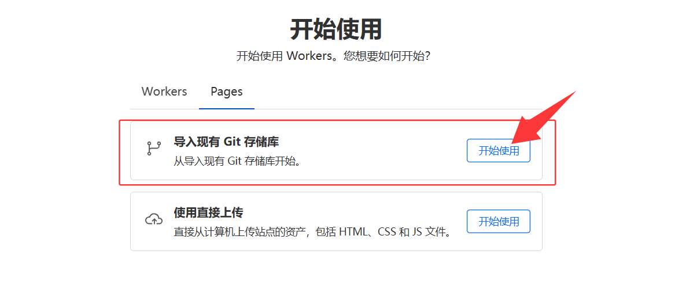
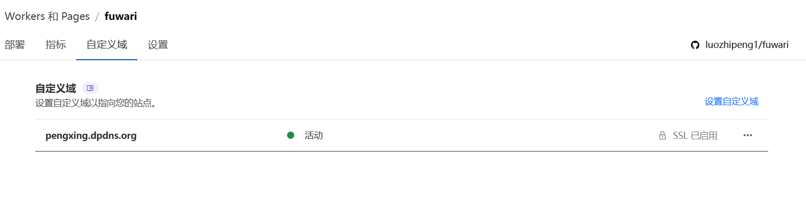

# 一、前言

折腾过不少博客框架，比如 **VanBlog**、**Halo**、**Word Press**，它们都提供了简洁易用的后台功能和优雅的文章管理体验。虽然动态博客框架功能强大，但需要定期维护服务器和数据库，长期使用下来成本较高。

随着现代前端技术的飞速发展，我逐渐转向静态站点的方案。最终，我选择了基于 **Astro** 框架和 **fuwari** 主题的静态博客，简单易上手，部署便捷，非常适合专注写作和内容分享。

## 🌟 Astro 是啥？

简单说，**Astro** 是一个做静态网站的框架，特别适合像博客、个人主页、文档站这种内容为主的网站。它的一个大优点就是：**不用管前端那些花里胡哨的东西也能做出超快的网页**。

我自己选它，主要是因为它：

- 默认几乎不带 JavaScript，打开速度嗖嗖的；
- 写文章直接用 Markdown，配图、加代码块都很方便；
- 想加点互动？它也支持 React、Vue、Svelte 这些框架，而且可以混着用；
- 页面是“静态”的，部署超简单，丢到 GitHub Pages、Vercel、Netlify 都行；
- 最重要的，对我这种懒人来说：**写完就丢线上，不用操心服务器和数据库**。

## ✨ fuwari功能特性

-  基于 Astro 和 Tailwind CSS 开发
-  流畅的动画和页面过渡
-  亮色 / 暗色模式
-  自定义主题色和横幅图片
-  响应式设计
-  评论
-  搜索
-  文内目录

# 二、搭建需求

## 开始之前，先准备些东西！

1. [**Git**](https://git-scm.com/downloads)：版本控制工具，拿来上传、同步代码用的，基本操作得会一点。
2. [**Node.js**](https://nodejs.org/en)：因为 Fuwari 主题是跑在 Node.js 上的，所以必须先装它。
3. [**GitHub**](https://github.com/) 账号：博客文件要有个“家”，就放在 GitHub 的仓库里。
4. [**Cloudflare**](https://cloudflare.com/) 账号：部署博客用的，可以帮你免费生成一个可以访问的网址。如果你更喜欢用 Vercel、Netlify 或 GitHub Pages 也完全没问题～
5. 一个顺手的 **Markdown 编辑器**：比如 [Typora](https://typoraio.cn/) 或 [MarkText](https://www.marktext.cc/)，写文章超级方便。如果 Markdown 语法不太熟，戳这学习下 👉 [Markdown 教程](https://markdown.com.cn/basic-syntax/)

#### 开搞吧

# 三、本地部署Fuwari

#### 仓库

::github{repo="withastro/astro"}

::github{repo="saicaca/fuwari"}

1. 使用此模板[生成新仓库](https://github.com/saicaca/fuwari/generate)或 Fork 此仓库
2. 进行本地开发，Clone 新的仓库，执行`pnpm install`
   - 若未安装 [pnpm](https://pnpm.io/)，执行 `npm install -g pnpm`
3. 至此部署成功执行 `pnpm dev` ,即可本地运行

# 四、博客配置

## 1.基本配置

你可以通过配置文件 `src/config.ts` 自定义博客，这里以我自己的配置文件为例：

### 博客基本内容：

:::note[注意] 

下面用其他颜色标记的是我改动的地方，其他的都是默认，不过在部署的过程中，随便改改玩，试试每一个的效果

:::

```js title="src/config.ts 的 siteConfig" ins={2-4,10,26}
export const siteConfig: SiteConfig = {
	title: "PengXing's Blog", // 标题
	subtitle: "爱你所爱！", // 副标题
	lang: "zh_CN", // 'en', 'zh_CN', 'zh_TW', 'ja', 'ko', 'es', 'th' 语言设置
	themeColor: {
		hue: 250, // 主题色的色调范围从0到360。例如：红色：0，青色：200，蓝色：250，粉色：345
		fixed: false, // 是否隐藏主题颜色选择器，访客可见
	},
	banner: {
		enable: true, // 是否启用横幅
		src: "assets/images/demo-banner.png", // 横幅图片的路径，相对于 /src 目录，如果路径以 / 开头则相对于 /public 目录，或者完整路径的网络图片
		position: "center", // 横幅位置，对应 object-position 属性，只支持 'top', 'center', 'bottom'，默认为 'center'
		credit: {
			enable: false, // 是否显示横幅图片的版权信息
			text: "", // 显示的版权文字
			url: "", // （可选）指向原始艺术作品或艺术家页面的 URL 链接
		},
	},
	toc: {
		enable: true, // 是否在文章右侧显示目录
		depth: 2, // 显示目录的最大标题深度，从 1 到 3
	},
	favicon: [
		// 留空数组以使用默认的 favicon
		{
			src: "/favicon/favicon.ico", // favicon 的路径，相对于 /public 目录
			theme: "light", // （可选）设置为 'light' 或 'dark'，仅当有不同的 favicon 时才设置
			sizes: "32x32", // （可选）favicon 的尺寸，仅当有不同尺寸的 favicon 时设置
		},
	],
};
```

### 个人信息与联系方式：

```js title="src/config.ts 的 profileConfig"  ins={3-4,23-32} collapse={6-22}
export const profileConfig: ProfileConfig = {
	avatar: "assets/images/demo-avatar.png", // 头像路径，相对于 /src 目录，如果路径以 / 开头则相对于 /public 目录
	name: "鹏星",
	bio: "Love what you love,  all will be well! / 爱你所爱，一切美好！", // 个人简介
	links: [
		// {
		// 	name: "Twitter",
		// 	icon: "fa6-brands:twitter", // Visit https://icones.js.org/ for icon codes
		// 	// You will need to install the corresponding icon set if it's not already included
		// 	// `pnpm add @iconify-json/<icon-set-name>`
		// 	url: "https://twitter.com",
		// },
		// {
		// 	name: "Steam",
		// 	icon: "fa6-brands:steam",
		// 	url: "https://store.steampowered.com",
		// },
		// {
		// 	name: "GitHub",
		// 	icon: "fa6-brands:github",
		// 	url: "https://github.com/saicaca/fuwari",
		// },
		{
			name: "QQ频道",
			icon: "fa6-brands:qq",
			url: "https://pd.qq.com/s/38it5vmzn",
		},
		{
			name: "link3",
			icon: "fa6-brands:staylinked",
			url: "https://link3.cc/pyxh",
		},
	],
};
```

## 2. 创建文章

在`src/content/posts/`目录中创建`.md`或终端中执行 `pnpm new-post <filename>` 创建新文章并编辑。

### 文章格式：

:::warning[注意]

最新的 [fuwari](https://github.com/saicaca/fuwari) ，新建文章可能没有`updated`，需要自行到`scripts\new-post.js`配置

:::

```js title="scripts\new-post.js" ins={4}
const content = `---
title: ${args[0]}
published: ${getDate()}
updated: ${getDate()}
description: ''
image: ''
tags: []
category: ''
draft: false 
lang: ''
pinned: false
series: ''
---
`;
```

```js title="demo.md"
---
title: 新文章  # 文章标题
published: 2025-09-22        # 发布时间
updated: 2025-09-22          # 最后更新时间,后面文章更新需要手动更改
description: '创建新的文章'      # 简短描述，用于概述文章内容
image: ./img.jpg  //文章封面，可留空
tags: [ 文章, 个人]  # 标签列表，方便分类和搜索
category: '日常'              # 所属分类
draft: false                  # 是否为草稿（true 表示尚未发布）
lang: 'ja'      //仅当文章语言与 `config.ts` 中的网站语言不同时需要设置
---
```

# 五、部署上线

## 1.准备工作

部署前需编辑 `astro.config.mjs` ,改为你的域名

```js title="astro.config.mjs" 
// https://astro.build/config
export default defineConfig({
	site: "https://pengxing.dpdns.org/", // 站点地址
	base: "/",
	trailingSlash: "always",
	integrations: [
		tailwind({
			nesting: true,
		}),
        // ..........
}        
```

## 2.连接至Cloudflare

[官方指南](https://docs.astro.build/zh-cn/guides/deploy/)将博客部署至 Cloudflare,Vercel, Netlify, GitHub Pages 等；

本篇只介绍**Cloudflare**(本人在用)

#### 连接至Cloudflare

### 前往[Cloudflare](https://dash.cloudflare.com/)的 创建一个Pages



### 选择导入现有Git存储库,连接你的Github



### 设置构建命令：`pnpm build` ，然后设置构建输出目录：`dist`


到这里就结束了，你只需要在本地编写文章，然后用Git将更改推送到远程仓库，Cloudflare就会自动部署，用Cloudflare分配给你的链接即可访问博客

### 有域名的话绑定自定域名



# 四、个性化

## 1.添加ICP备案和运行时间

在 `src/components/Footer.astro` 文件中 例:

```js title="src\components\Footer.astro"
---

import { profileConfig } from "../config";
import { url } from "../utils/url-utils";
const currentYear = new Date().getFullYear();
---

<!--<div class="border-t border-[var(&#45;&#45;primary)] mx-16 border-dashed py-8 max-w-[var(&#45;&#45;page-width)] flex flex-col items-center justify-center px-6">-->
<div class="transition border-t border-black/10 dark:border-white/15 my-10 border-dashed mx-32"></div>
<!--<div class="transition bg-[oklch(92%_0.01_var(&#45;&#45;hue))] dark:bg-black rounded-2xl py-8 mt-4 mb-8 flex flex-col items-center justify-center px-6">-->
<div class="transition border-dashed border-[oklch(85%_0.01_var(--hue))] dark:border-white/15 rounded-2xl mb-12 flex flex-col items-center justify-center px-6">
    <div class="transition text-50 text-sm text-center">
        &copy; <span id="copyright-year">{currentYear}</span> {profileConfig.name}. All Rights Reserved. /
        Powered by
        <a class="transition link text-[var(--primary)] font-medium" target="_blank" href="https://astro.build">Astro</a> &
        <a class="transition link text-[var(--primary)] font-medium" target="_blank" href="https://github.com/saicaca/fuwari">Fuwari</a>
        <br>
        <a class="transition link text-[var(--primary)] font-medium" + target="_blank" href="https://beian.miit.gov.cn/">
            ICP备XXXXXXXXX号-1</a>
    </div>
    <script type="text/javascript">function runtime(){const t=new Date("07/01/2023 08:00:00"),n=new Date,s=n-t,e=Math.floor(s/1e3),o=Math.floor(e/86400),i=Math.floor(e%86400/3600),a=Math.floor(e%3600/60),r=e%60;document.getElementById("runningtime").innerHTML=`✨本站竟然运行了: ${o}天${i}小时${a}分${r}秒 ☁🤩`}setInterval(runtime,1e3)</script>
    <div class="transition text-50 text-sm text-center hidden md:block"><p id="runningtime"> </p></div>
</div>
```

