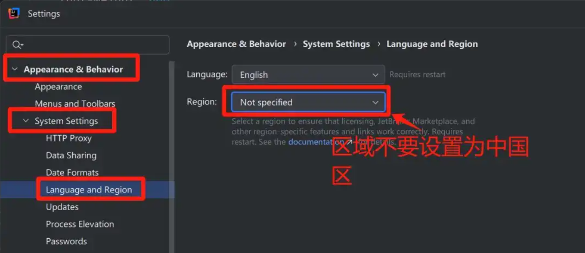
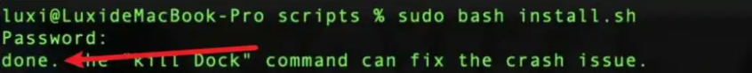

>申明：本教程 IntelliJ IDEA 破解补丁、激活码均收集于网络，请勿商用，仅供个人学习使用，如有侵权，请联系作者删除。若条件允许，希望,大家购买正版 ！
>
>**本文提供三种激活方式，MAC，Windows，Linux均可使用**
>
>PS: 本教程最新更新时间: 2025年9月26日, 网站持续更新，收藏本站防失联哟~


废话不多说，先上 `IDEA 2025.2.2` 版本破解成功的截图，如下，可以看到已经成功破解到 2099 年辣，舒服！


## 卸载老版本 IDEA

接下来，我就将通过图文的方式, 来详细讲解如何激活 `IDEA 2025.2.2` 版本至 2099 年。首先，如果小伙伴的电脑上有安装老版本的 IDEA , 需要将其彻底卸载掉，如下所示（没有安装则不用管，直接安装即可）：

> 如果你之前使用过本站提供的激活到 2026 年版本脚本 ，需要执行对应卸载脚本，将自动添加的环境变量删除（若没使用过，则可忽略，继续下面的步骤）；


将 **删除缓存和本地历史** 勾选上，点击 **卸载** 按钮开始卸载：


卸载完成后，点击 **关闭** 按钮。

## 下载 IDEA 安装包

访问 `IDEA`官网：https://www.jetbrains.com/idea/download/ ，下载 `IDEA 2025.2.2` 版本的安装包。


## 开始安装

下载完成后，双击 `.exe` 安装包开始安装 `IDEA` :


点击 **下一步** 按钮：


**自定义安装路径**，我这里安装在了 `D:\` 盘下，继续点击 **下一步** 按钮：


进入到 **安装选项** 的选择，**将下图标注的部分，全部勾选上**，点击 **下一步** 按钮：


点击 **安装** 按钮，等待 IDEA 安装完成：


安装成功后，会弹出如下提示框，`运行 IntelliJ IDEA(R)`


点击 ***完成*** 按钮，关闭弹框。

## 下载破解脚本

破解脚本我放置在了网盘中，并提供了多个备用链接，以防下载失效。

> 提示：破解脚本的网盘链接文末获取~ 
>
> 提示：破解脚本的网盘链接文末获取~ 
>
> 提示：破解脚本的网盘链接文末获取~

:::tip[win11电脑首次安装]

我本次安装是把电脑系统升级到win11，其次已经彻底卸载`IDEA`，可以当作电脑首次安装

:::

## 启动 IDE

双击桌面的 `IDEA` 快捷启动图标，来打开 `IDEA` 。注意，`2024.2` 之后的版本，若初次安装，会提示选择所在区域，如下图所示，如果选择了 `China Mainland`，会在激活的时候反复跳出激活码并提示激活码无效，原因是新版本会拦截 `.cn` 域名，导致激活许可被吊销，所以，**千万不要指定区域！！**


如果是老用户，则可以在设置菜单中来更改（一定要更改）：



## 开始激活(方式一 网上多为使用版本)

补丁下载成功后，记得**先解压**, 解压后的目录如下, **本文后面所需补丁都在下面标注的这个文件夹中**：


> 注意： **补丁所属文件夹需单独存放**，且**放置的路径不要有中文与空格**，以免 IDEA 读取补丁错误。**以后这个文件夹不要动**

点击进入 `/jetbra2026` 补丁目录，再点击进入 `/scripts` 文件夹，双击执行 `install-current-user.vbs` 破解脚本：


> 注意：**如果执行脚本被安全软件提示有风险拦截，允许执行即可。**


会提示安装补丁需要等待数秒。点击【**确定**】按钮后，过程大概 5- 30 秒，如看到弹框提示 `Done` 时，表示激活破解成功：


### Mac / Linux 系统

Mac / Linux 系统与上面 Windows 系统一样，需将补丁所属文件 `/jetbra2026` 复制到某个路径，且**路径不能包含空格与中文**。

之后，打开终端，进入到 `/jetbra2026/scripts` 文件夹， 执行 `install.sh` 脚本, 命令如下：

```
sudo bash install.sh
```

看到提示 `Done` , 表示激活成功。



部分小伙伴 Mac/Linux 系统执行脚本遇到如下错误：


**解决方法：**

可先执行如下命令，再执行脚本：

```
export LC_COLLATE='C'
export LC_CTYPE='C'
```


### 填入指定激活码完成激活

重新打开 IDEA后，复制下面的激活码：

```js title="idea.key"
FV8EM46DQYC5AW9-eyJsaWNlbnNlSWQiOiJGVjhFTTQ2RFFZQzVBVzkiLCJsaWNlbnNlZU5hbWUiOiJtZW5vcmFoIHBhcmFwZXQiLCJsaWNlbnNlZVR5cGUiOiJQRVJTT05BTCIsImFzc2lnbmVlTmFtZSI6IiIsImFzc2lnbmVlRW1haWwiOiIiLCJsaWNlbnNlUmVzdHJpY3Rpb24iOiIiLCJjaGVja0NvbmN1cnJlbnRVc2UiOmZhbHNlLCJwcm9kdWN0cyI6W3siY29kZSI6IlBDV01QIiwiZmFsbGJhY2tEYXRlIjoiMjAyNi0wOS0xNCIsInBhaWRVcFRvIjoiMjAyNi0wOS0xNCIsImV4dGVuZGVkIjp0cnVlfSx7ImNvZGUiOiJQUlIiLCJmYWxsYmFja0RhdGUiOiIyMDI2LTA5LTE0IiwicGFpZFVwVG8iOiIyMDI2LTA5LTE0IiwiZXh0ZW5kZWQiOnRydWV9LHsiY29kZSI6IlBEQiIsImZhbGxiYWNrRGF0ZSI6IjIwMjYtMDktMTQiLCJwYWlkVXBUbyI6IjIwMjYtMDktMTQiLCJleHRlbmRlZCI6dHJ1ZX0seyJjb2RlIjoiUFNJIiwiZmFsbGJhY2tEYXRlIjoiMjAyNi0wOS0xNCIsInBhaWRVcFRvIjoiMjAyNi0wOS0xNCIsImV4dGVuZGVkIjp0cnVlfSx7ImNvZGUiOiJJSSIsImZhbGxiYWNrRGF0ZSI6IjIwMjYtMDktMTQiLCJwYWlkVXBUbyI6IjIwMjYtMDktMTQiLCJleHRlbmRlZCI6ZmFsc2V9XSwibWV0YWRhdGEiOiIwMjIwMjQwNzAyUFNBWDAwMDAwNVgiLCJoYXNoIjoiMTIzNDU2NzgvMC01NDE4MTY2MjkiLCJncmFjZVBlcmlvZERheXMiOjcsImF1dG9Qcm9sb25nYXRlZCI6ZmFsc2UsImlzQXV0b1Byb2xvbmdhdGVkIjpmYWxzZSwidHJpYWwiOmZhbHNlLCJhaUFsbG93ZWQiOnRydWV9-cH8qBniG31nF8954hthJJuzF6Fk4RQ9T03IfNxsFkuxUcwaAGHKOcRudvBZIAbLwDDFw63q2QZsnpwthBb/6IqBYnJrjRC83a8wkYKGN8HqAyDtbqdLOxLjcaiAiSKzektfAXn6nGNfDeygcFr/WzMfI0on/43ByuwxmSrjwYc4M8SCR0nkDAi0XwXNnFp3vSp0gJQd+lJtkSHO2KR7gUyNDZOPVduljJGbdLJUK6UcUjrlAd6NrTNqpu5P7hcYRaNzjoJ0KeIx5k9KmMCdcfQBia/zSHUbwZiecFsyjxqtIU0C3TDaX1OM4siJVDpgrXi+ocY86hiiYE79ygJf2IA==-MIIETDCCAjSgAwIBAgIBDTANBgkqhkiG9w0BAQsFADAYMRYwFAYDVQQDDA1KZXRQcm9maWxlIENBMB4XDTIwMTAxOTA5MDU1M1oXDTIyMTAyMTA5MDU1M1owHzEdMBsGA1UEAwwUcHJvZDJ5LWZyb20tMjAyMDEwMTkwggEiMA0GCSqGSIb3DQEBAQUAA4IBDwAwggEKAoIBAQCUlaUFc1wf+CfY9wzFWEL2euKQ5nswqb57V8QZG7d7RoR6rwYUIXseTOAFq210oMEe++LCjzKDuqwDfsyhgDNTgZBPAaC4vUU2oy+XR+Fq8nBixWIsH668HeOnRK6RRhsr0rJzRB95aZ3EAPzBuQ2qPaNGm17pAX0Rd6MPRgjp75IWwI9eA6aMEdPQEVN7uyOtM5zSsjoj79Lbu1fjShOnQZuJcsV8tqnayeFkNzv2LTOlofU/Tbx502Ro073gGjoeRzNvrynAP03pL486P3KCAyiNPhDs2z8/COMrxRlZW5mfzo0xsK0dQGNH3UoG/9RVwHG4eS8LFpMTR9oetHZBAgMBAAGjgZkwgZYwCQYDVR0TBAIwADAdBgNVHQ4EFgQUJNoRIpb1hUHAk0foMSNM9MCEAv8wSAYDVR0jBEEwP4AUo562SGdCEjZBvW3gubSgUouX8bOhHKQaMBgxFjAUBgNVBAMMDUpldFByb2ZpbGUgQ0GCCQDSbLGDsoN54TATBgNVHSUEDDAKBggrBgEFBQcDATALBgNVHQ8EBAMCBaAwDQYJKoZIhvcNAQELBQADggIBABKaDfYJk51mtYwUFK8xqhiZaYPd30TlmCmSAaGJ0eBpvkVeqA2jGYhAQRqFiAlFC63JKvWvRZO1iRuWCEfUMkdqQ9VQPXziE/BlsOIgrL6RlJfuFcEZ8TK3syIfIGQZNCxYhLLUuet2HE6LJYPQ5c0jH4kDooRpcVZ4rBxNwddpctUO2te9UU5/FjhioZQsPvd92qOTsV+8Cyl2fvNhNKD1Uu9ff5AkVIQn4JU23ozdB/R5oUlebwaTE6WZNBs+TA/qPj+5/we9NH71WRB0hqUoLI2AKKyiPw++FtN4Su1vsdDlrAzDj9ILjpjJKA1ImuVcG329/WTYIKysZ1CWK3zATg9BeCUPAV1pQy8ToXOq+RSYen6winZ2OO93eyHv2Iw5kbn1dqfBw1BuTE29V2FJKicJSu8iEOpfoafwJISXmz1wnnWL3V/0NxTulfWsXugOoLfv0ZIBP1xH9kmf22jjQ2JiHhQZP7ZDsreRrOeIQ/c4yR8IQvMLfC0WKQqrHu5ZzXTH4NO3CwGWSlTY74kE91zXB5mwWAx1jig+UXYc2w4RkVhy0//lOmVya/PEepuuTTI4+UJwC7qbVlh5zfhj8oTNUXgN0AOc+Q0/WFPl1aw5VV/VrO8FCoB15lFVlpKaQ1Yh+DVU8ke+rt9Th0BCHXe0uZOEmH0nOnH/0onD
```


成功激活，显示2026年，这里不用在意激活的时间，已经破解成功，可正常开发使用。


## 开始激活(方式二 推荐)，已经试用30天的，此方法有概率失败

下载成功后，如下，是个**EXE格式压缩包**，先对它进行解压：


> 进入到解压后的文件夹 `/win2020-2024(一键激活)` 中，双击IDEA激活.vbs，如果弹出`Please launch your IntelliJIdea first!`，这个就需要首先运行一下idea软件，打开就关闭，就是在电脑上跑一下idea软件而已。


进入到解压后的文件夹 `/win2020-2024(一键激活)` 中，双击 **IDEA激活.vbs** ，若提示 `Success!!! Now you can enjoy IntelliJIdea to 2099` , 则表示 `IDEA `激活成功啦~


### 检查是否激活成功

激活成功后，双击桌面的 IDEA 快捷启动图标，来打开 IDEA 。进入 IDEA 中后，点击菜单 `Help | Register` , 即可查看 IDEA 的激活到期时间：如下图标注所示，根据日期显示直到 2099 年才会失效，确实是破解成功了：


## 开始激活(方式三 推荐)，正常情况100%成功

下载这个文件夹


找到 `IDEA` 软件的安装路径，小编的安装路径：`D:\IntelliJ IDEA 2025.2.2\bin`，同时使用记事本打开 `idea64.exe.vmoptions`


在 `idea64.exe.vmoptions` 输入以下代码：

```
--add-opens=java.base/jdk.internal.org.objectweb.asm=ALL-UNNAMED
--add-opens=java.base/jdk.internal.org.objectweb.asm.tree=ALL-UNNAMED

#破解工具路径  需要换成自己的工具路径
-javaagent:D:\2020.3.4IDEAcrack\idea2099\active-idea.jar
```


### 填入指定激活码完成激活

重新打开 IDEA后，复制下面的激活码：

```js title="idea.key"
9PPM13JQQY-eyJsaWNlbnNlSWQiOiI5UFBNMTNKUVFZIiwibGljZW5zZWVOYW1lIjoiY2F0IG1ldGhvZCIsImFzc2lnbmVlTmFtZSI6IiIsImFzc2lnbmVlRW1haWwiOiIiLCJsaWNlbnNlUmVzdHJpY3Rpb24iOiIiLCJjaGVja0NvbmN1cnJlbnRVc2UiOmZhbHNlLCJwcm9kdWN0cyI6W3siY29kZSI6IlBXUyIsImZhbGxiYWNrRGF0ZSI6IjIwMjMtMDYtMDEiLCJwYWlkVXBUbyI6IjIwMjMtMDYtMDEiLCJleHRlbmRlZCI6dHJ1ZX0seyJjb2RlIjoiUERCIiwiZmFsbGJhY2tEYXRlIjoiMjAyMy0wNi0wMSIsInBhaWRVcFRvIjoiMjAyMy0wNi0wMSIsImV4dGVuZGVkIjp0cnVlfSx7ImNvZGUiOiJQU1ciLCJmYWxsYmFja0RhdGUiOiIyMDIzLTA2LTAxIiwicGFpZFVwVG8iOiIyMDIzLTA2LTAxIiwiZXh0ZW5kZWQiOnRydWV9LHsiY29kZSI6IlBSQiIsImZhbGxiYWNrRGF0ZSI6IjIwMjMtMDYtMDEiLCJwYWlkVXBUbyI6IjIwMjMtMDYtMDEiLCJleHRlbmRlZCI6dHJ1ZX0seyJjb2RlIjoiUFNJIiwiZmFsbGJhY2tEYXRlIjoiMjAyMy0wNi0wMSIsInBhaWRVcFRvIjoiMjAyMy0wNi0wMSIsImV4dGVuZGVkIjp0cnVlfSx7ImNvZGUiOiJQR08iLCJmYWxsYmFja0RhdGUiOiIyMDIzLTA2LTAxIiwicGFpZFVwVG8iOiIyMDIzLTA2LTAxIiwiZXh0ZW5kZWQiOnRydWV9LHsiY29kZSI6IlBQUyIsImZhbGxiYWNrRGF0ZSI6IjIwMjMtMDYtMDEiLCJwYWlkVXBUbyI6IjIwMjMtMDYtMDEiLCJleHRlbmRlZCI6dHJ1ZX0seyJjb2RlIjoiUFBDIiwiZmFsbGJhY2tEYXRlIjoiMjAyMy0wNi0wMSIsInBhaWRVcFRvIjoiMjAyMy0wNi0wMSIsImV4dGVuZGVkIjp0cnVlfSx7ImNvZGUiOiJQQ1dNUCIsImZhbGxiYWNrRGF0ZSI6IjIwMjMtMDYtMDEiLCJwYWlkVXBUbyI6IjIwMjMtMDYtMDEiLCJleHRlbmRlZCI6dHJ1ZX0seyJjb2RlIjoiSUkiLCJmYWxsYmFja0RhdGUiOiIyMDIzLTA2LTAxIiwicGFpZFVwVG8iOiIyMDIzLTA2LTAxIiwiZXh0ZW5kZWQiOmZhbHNlfV0sIm1ldGFkYXRhIjoiMDEyMDIyMDYwMVBTQU4wMDAwMDUiLCJoYXNoIjoiVFJJQUw6LTE5NzMwODYzMiIsImdyYWNlUGVyaW9kRGF5cyI6NywiYXV0b1Byb2xvbmdhdGVkIjpmYWxzZSwiaXNBdXRvUHJvbG9uZ2F0ZWQiOmZhbHNlfQ==-P0n5WNbm7POecGXoOAsmSv9RVkBrrKm5PvBN59x/mXNvetWjgbQf6p926HduPz58bg+3SdpPDPWkcWtY06El7L/XXZVvWwKwlvdR6Vkhy1+GRiuu56Ix1JBO9cM1evwDYW21wpr0KMJ3zaLA6Vi9BUm/N8a39G4PaZn+rVdSjVwRFjF7bt5rIqOktkLe7UM6os5Z4RxcX7h7/rpVlpPwlg1teMu/+BLaP7AzFZNLY58HUJhub00TaYoOVuiYu+WozZIIBHdrmPWnS372qV2Vu+NZPksjlTqcxXM8LOhuZcuFZtlVsXMrgIoxUni+FRjwf57BYADXfhxX+iOl3kh2uQ==-MIIETDCCAjSgAwIBAgIBDTANBgkqhkiG9w0BAQsFADAYMRYwFAYDVQQDDA1KZXRQcm9maWxlIENBMB4XDTIwMTAxOTA5MDU1M1oXDTIyMTAyMTA5MDU1M1owHzEdMBsGA1UEAwwUcHJvZDJ5LWZyb20tMjAyMDEwMTkwggEiMA0GCSqGSIb3DQEBAQUAA4IBDwAwggEKAoIBAQCUlaUFc1wf+CfY9wzFWEL2euKQ5nswqb57V8QZG7d7RoR6rwYUIXseTOAFq210oMEe++LCjzKDuqwDfsyhgDNTgZBPAaC4vUU2oy+XR+Fq8nBixWIsH668HeOnRK6RRhsr0rJzRB95aZ3EAPzBuQ2qPaNGm17pAX0Rd6MPRgjp75IWwI9eA6aMEdPQEVN7uyOtM5zSsjoj79Lbu1fjShOnQZuJcsV8tqnayeFkNzv2LTOlofU/Tbx502Ro073gGjoeRzNvrynAP03pL486P3KCAyiNPhDs2z8/COMrxRlZW5mfzo0xsK0dQGNH3UoG/9RVwHG4eS8LFpMTR9oetHZBAgMBAAGjgZkwgZYwCQYDVR0TBAIwADAdBgNVHQ4EFgQUJNoRIpb1hUHAk0foMSNM9MCEAv8wSAYDVR0jBEEwP4AUo562SGdCEjZBvW3gubSgUouX8bOhHKQaMBgxFjAUBgNVBAMMDUpldFByb2ZpbGUgQ0GCCQDSbLGDsoN54TATBgNVHSUEDDAKBggrBgEFBQcDATALBgNVHQ8EBAMCBaAwDQYJKoZIhvcNAQELBQADggIBAB2J1ysRudbkqmkUFK8xqhiZaYPd30TlmCmSAaGJ0eBpvkVeqA2jGYhAQRqFiAlFC63JKvWvRZO1iRuWCEfUMkdqQ9VQPXziE/BlsOIgrL6RlJfuFcEZ8TK3syIfIGQZNCxYhLLUuet2HE6LJYPQ5c0jH4kDooRpcVZ4rBxNwddpctUO2te9UU5/FjhioZQsPvd92qOTsV+8Cyl2fvNhNKD1Uu9ff5AkVIQn4JU23ozdB/R5oUlebwaTE6WZNBs+TA/qPj+5/we9NH71WRB0hqUoLI2AKKyiPw++FtN4Su1vsdDlrAzDj9ILjpjJKA1ImuVcG329/WTYIKysZ1CWK3zATg9BeCUPAV1pQy8ToXOq+RSYen6winZ2OO93eyHv2Iw5kbn1dqfBw1BuTE29V2FJKicJSu8iEOpfoafwJISXmz1wnnWL3V/0NxTulfWsXugOoLfv0ZIBP1xH9kmf22jjQ2JiHhQZP7ZDsreRrOeIQ/c4yR8IQvMLfC0WKQqrHu5ZzXTH4NO3CwGWSlTY74kE91zXB5mwWAx1jig+UXYc2w4RkVhy0//lOmVya/PEepuuTTI4+UJwC7qbVlh5zfhj8oTNUXgN0AOc+Q0/WFPl1aw5VV/VrO8FCoB15lFVlpKaQ1Yh+DVU8ke+rt9Th0BCHXe0uZOEmH0nOnH/0onD
```


## 历史版本下载链接：

https://www.jetbrains.com/idea/download/other.html ，找到想要的版本，下载对应系统的安装包即可。

## 激活脚本下载地址

夸克网盘：https://pan.quark.cn/s/ad4df2db1124

百度网盘：https://pan.baidu.com/s/1U7edqb2B-fGm1yz4D7D7QA?pwd=pyxh

UC网盘：https://drive.uc.cn/s/e69d33d2ebef4?public=1

**第三种方案文件获取（手机上复制口令到对应的浏览器或者网盘打开）**

下载地址：UC口令-----> 嗖开发工具全家桶扣聆

下载地址：夸克口令-----> 动作壬曲鳢噤蠡多好

下载地址：训雷口令-----> 鹏摇星海