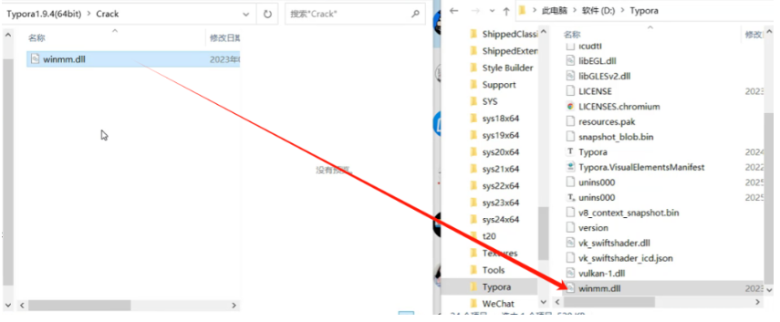

进入 [Typora 官方中文站](https://typoraio.cn/)

下载并安装，假设你的安装路径为 `D:/App/Typora`

关闭所有Typora相关进程

用VSCode打开 `D:/App/Typora`

全局搜索，将

```
e.hasActivated="true"==e.hasActivated
```

改为

```
e.hasActivated="true"==“true”
```

打开 Typora，已激活


## 软件下载

如果以上方法不行，还可以直接下载网盘中的Typora

**下载链接：** https://pan.baidu.com/s/1BMExIudcPn0uFCf58ar5wQ?pwd=pyxh

