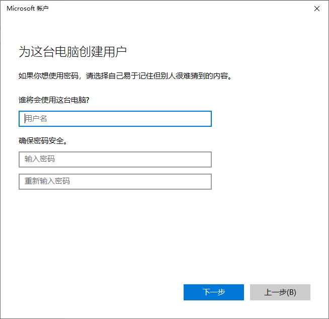

打开计算机管理却发现本地用户和组不见了？要找回它们很简单，只需在Microsoft管理控制台或控制面板添加即可。

有的时候我们想为计算机添加一个新用户，打开计算机管理却发现本地用户和组不见了。**那遇到计算机管理没有本地用户和组该怎么办？**我们可以通过**Microsoft管理控制台**或**控制面板**添加本地用户和组以解决问题。

## 一、在控制台添加本地用户和组

本地用户是可以用来在本地登录的账户，不同账户权限有所不同，在计算机中所能使用的功能也会有着不同的限制，而组则是本地用户管理的单元。若遇到Windows 10本地用户和组不见了，你可以在Microsoft管理控制台添加本地用户和组。操作步骤如下：

**1.** 按键盘上的**“Windows + R”**组合键打开运行对话框，然后输入**“mmc”**,再单击**“确定”**打开Microsoft管理控制台。

**2.** 进入控制台后，单击窗口左上角的**“文件” > “添加/删除管理单元”**。

 

**3.** 在添加或删除管理员单元窗口左侧的**“可用的管理单元”**中找到**“本地用户和组”**，然后选中**“本地用户和组”**，再单击中间的**“添加”**按钮。

 

**4.** 在弹出的选择目标机器窗口中，选择**“本地计算机（运行此控制台的计算机）”**，再单击**“完成”**即可。

 

若你点击**“完成”**按钮提示**“此管理单元不能用于这一版本的Windows 10”**，则说明你的Windows 10版本可能是家庭版，你可以将版本升级到专业版或采用下面的方法添加用户账户。

## 二、通过控制面板添加用户

在Microsoft管理控制台添加本地用户和组失败，是因为Windows 10家庭版没有本地用户和组。那Windows 10家庭版没有本地用户和组怎么办？你可以通过控制面板添加用户以解决问题，具体的操作步骤如下：

**1.** 打开**“控制面板”**，在控制面板中单击**“用户账户”**。

 

**2.** 进入**“用户账户”**后，再次单击**“用户账户”**。

 

**3.** 在此窗口中，单击**“管理其他账户”**。

 

**4.** 进入**“管理账户”**窗口后，再单击**“在电脑设置中添加新用户”**。

 

**5.** 然后在**“家庭和其他用户”**中，你可以单击**“将其他人添加到这台电脑”**以添加新的用户账户。

 

**6.** 接着会让你登录Microsoft账户，登录成功后再输入新账户的用户名和密码即可。

 

若你遇到打开计算机管理发现本地用户和组不见了，你可以在Microsoft管理控制台中重新添加本地用户和组，或者可以通过控制面板创建新的用户。以上就是本文的全部内容，希望对你有所帮助。