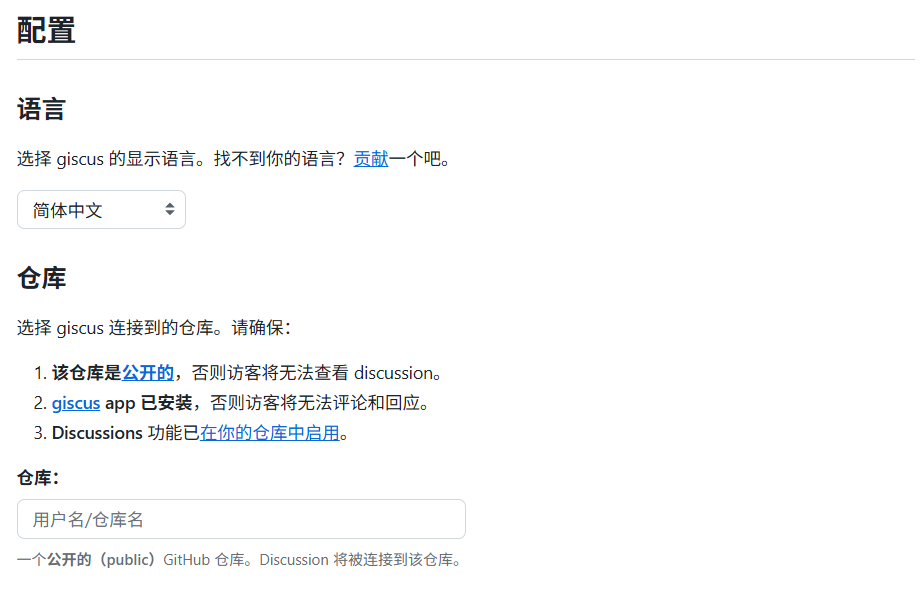
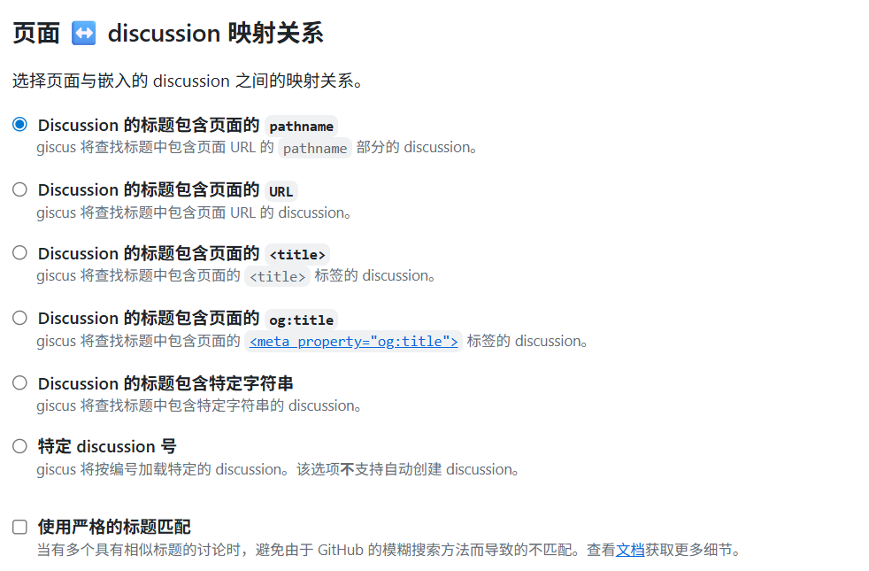
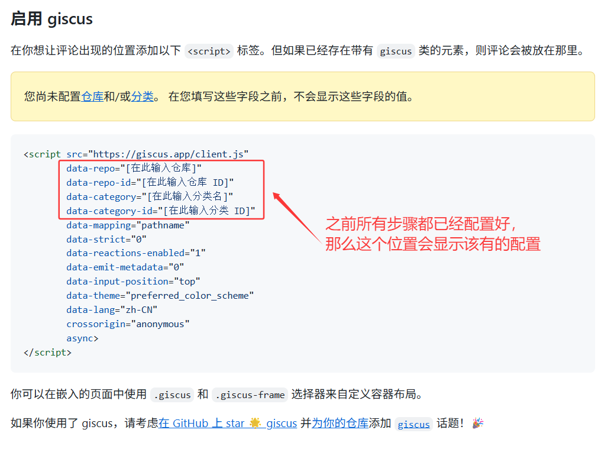

## 介绍

**Fuwari** 作为一款基于 Astro 框架的轻量级静态博客模板，以其简洁的设计和卓越的性能受到开发者青睐。然而，评论功能一直是静态博客的短板，传统评论系统往往需要复杂的后端配置和数据库支持。

本文将详细介绍如何为 Fuwari 静态博客无缝集成 **Giscus 评论系统**，实现基于 GitHub Discussions 的轻量级、无需数据库的评论解决方案。并实现兼容亮色/暗色主题的自适应效果。

## 配置

### 准备 GitHub 仓库

首先，我们需要在 GitHub 上创建一个专门用于存储评论的仓库。**这个仓库必须是公开的**，因为 Giscus 需要通过访问 GitHub 仓库来加载和提交评论。

1. **创建新仓库**
   - 登录 GitHub，点击右上角 ”+” 按钮
   - 选择 “New repository”
   - 填写仓库名称（如 `fuwari-comments`）和其他必要信息
   - 确保仓库可见性设置为 **Public**
2. **启用 Discussions 功能**
   - 进入仓库的 **Settings** → **Features**
   - 找到 “Discussions” 选项并勾选
   - 点击 “Save changes” 保存
   - Discussions 是 GitHub 为项目讨论提供的平台，Giscus 将利用这一功能存储评论

### 配置 Giscus

接下来，我们需要配置 Giscus 以将评论与我们的仓库关联起来。

1. **连接仓库**
   - 前往 https://giscus.app/zh-CN
   - 选择语言后在下方填写你的仓库
   - 通过检查后 Discussion 将被连接到该仓库

2. **选择映射关系** 推荐选择 `pathname`，假如你的文章路径为 `posts/helloworld`，那么只要你保证这个路径不变，评论和页面就永远匹配

3. **选择 Discussion 分类** 推荐使用 **公告（Announcements）** 类型的分类，以确保新 discussion 只能由仓库维护者和 giscus 创建

4. **获取配置信息**

   完成以上步骤后，记录以下配置信息，稍后将在 Fuwari 中使用：

   - 仓库名称
   - 仓库 ID
   - 分类名称
   - 分类 ID



### 添加到 Fuwari

1. **创建 Giscus 组件**

   为了实现在亮色/暗色下都能使 Giscus 完美显示,我们需要在 `src/components/misc/` 目录下创建 `Giscus.astro` 文件，内容如下：

```js title="src/components/misc/Giscus.astro" 
---
interface Props {
  repo: string;
  repoId: string;
  category: string;
  categoryId: string;
  mapping?: string;
  reactionsEnabled?: boolean;
  emitMetadata?: boolean;
  inputPosition?: 'top' | 'bottom';
  lang?: string;
}

const {
  repo,
  repoId,
  category,
  categoryId,
  mapping = 'pathname',
  reactionsEnabled = true,
  emitMetadata = false,
  inputPosition = 'bottom',
  lang = 'zh-CN'
} = Astro.props;
---

<div id="giscus-container"></div>

<script define:vars={{ repo, repoId, category, categoryId, mapping, reactionsEnabled, emitMetadata, inputPosition, lang }}>
  function loadGiscus() {
    const container = document.getElementById('giscus-container');
    if (!container) return;

    const isDark = document.documentElement.classList.contains('dark');
    const theme = isDark ? 'dark' : 'light';

    const script = document.createElement('script');
    script.src = 'https://giscus.app/client.js';
    script.setAttribute('data-repo', repo);
    script.setAttribute('data-repo-id', repoId);
    script.setAttribute('data-category', category);
    script.setAttribute('data-category-id', categoryId);
    script.setAttribute('data-mapping', mapping);
    script.setAttribute('data-strict', '0');
    script.setAttribute('data-reactions-enabled', reactionsEnabled ? '1' : '0');
    script.setAttribute('data-emit-metadata', emitMetadata ? '1' : '0');
    script.setAttribute('data-input-position', inputPosition);
    script.setAttribute('data-theme', theme);
    script.setAttribute('data-lang', lang);
    script.setAttribute('data-loading', 'lazy');
    script.crossOrigin = 'anonymous';
    script.async = true;

    container.appendChild(script);
  }

  // 监听主题变化
  function updateGiscusTheme() {
    const giscusFrame = document.querySelector('iframe[src*="giscus"]');
    if (giscusFrame) {
      const isDark = document.documentElement.classList.contains('dark');
      const theme = isDark ? 'dark' : 'light';

      giscusFrame.contentWindow.postMessage({
        giscus: {
          setConfig: {
            theme: theme
          }
        }
      }, 'https://giscus.app');
    }
  }

  // 监听DOM变化来检测主题切换
  const observer = new MutationObserver((mutations) => {
    mutations.forEach((mutation) => {
      if (mutation.type === 'attributes' && mutation.attributeName === 'class') {
        updateGiscusTheme();
      }
    });
  });

  // 页面加载时初始化
  if (document.readyState === 'loading') {
    document.addEventListener('DOMContentLoaded', loadGiscus);
  } else {
    loadGiscus();
  }

  // 开始观察主题变化
  observer.observe(document.documentElement, {
    attributes: true,
    attributeFilter: ['class']
  });
</script>
```

2. **添加到文章页面**

   在 `src/pages/posts/[...slug].astro` 文件中：

   - 首先导入 Giscus 组件：

```js title="src/pages/posts/[...slug].astro" ins={2}
import path from "node:path";
import Giscus from "@components/misc/Giscus.astro";
import License from "@components/misc/License.astro";
import Markdown from "@components/misc/Markdown.astro";
import I18nKey from "@i18n/i18nKey";
import { i18n } from "@i18n/translation";
import MainGridLayout from "@layouts/MainGridLayout.astro";
import { getSortedPosts } from "@utils/content-utils";
import { getDir, getPostUrlBySlug } from "@utils/url-utils";
import { Icon } from "astro-icon/components";
import { licenseConfig } from "src/config";
import ImageWrapper from "../../components/misc/ImageWrapper.astro";
import PostMetadata from "../../components/PostMeta.astro";
import { profileConfig, siteConfig } from "../../config";
import { formatDateToYYYYMMDD } from "../../utils/date-utils";
```

- 然后在许可证组件之后添加 Giscus 组件：

```js title="src/pages/posts/[...slug].astro" ins={13,20}
 <!-- always show cover as long as it has one -->

            {entry.data.image &&
                <ImageWrapper id="post-cover" src={entry.data.image} basePath={path.join("content/posts/", getDir(entry.id))} class="mb-8 rounded-xl banner-container onload-animation"/>
            }


            <Markdown class="mb-6 markdown-content onload-animation">
                <Content />
            </Markdown>

            {licenseConfig.enable && <License title={entry.data.title} slug={entry.slug} pubDate={entry.data.published} class="mb-6 rounded-xl license-container onload-animation"></License>}
            <!-- 评论模块 -->
            <Giscus
                repo="luozhipeng1/fuwari"
                repoId="R_kgDOPvEVqw"
                category="Announcements"
                categoryId="DIC_kwDOPvEVq84CwMEH"
            />
            <br> 
        </div>
    </div>
```

保存文件后重新构建项目即可看到评论区

通过以上步骤，你就成功为 **Fuwari** 添加了功能完善的评论系统，！🎉